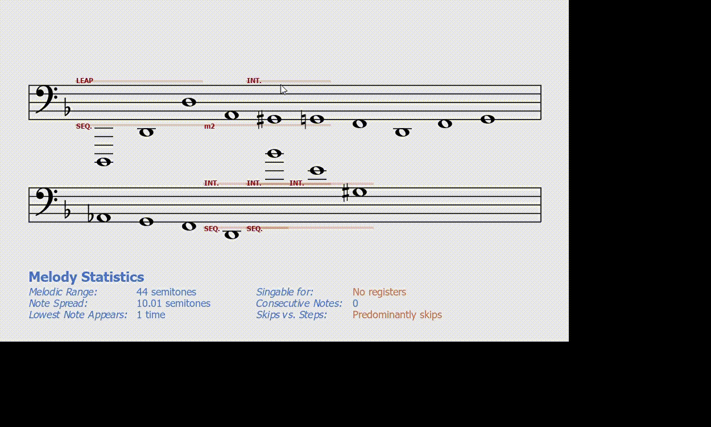
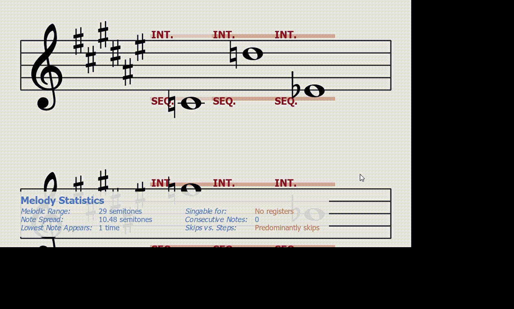

# Cantus Firmus Note Visualizer and Player

Cantus Firmus ("Fixed Melody" in Latin) is a collection of Renaissance-era conventions for composing melodies for Western classical music (more info at https://en.wikipedia.org/wiki/Cantus_firmus). It is formulated as many rules, such as:

- If note A jumps an octave to note B, the following note C must be between notes A and B
- If a sequence of notes are increasing, then the distance between the first and last note of the sequence must be a certain interval

This is not exhaustive. These rules can be logically encoded, so I decided to do build a system for working with musical notes from the ground-up, and used midiutil and pygame to create a GUI for checking whether melodies follow these rules.

This program supports:
- Displaying notes on a musical staff of any size
- Downloading and playing a melody that is written
- Detect whether to display notes in bass or treble clef
- Reading key signatures and formatting notes according to them

<p align="center">

</p>
<p align="center">

</p>

The black bottom-right part is the result of my screen recorder, not the program.

## Instructions

Upon running `main.py`, a command-line interface will allow the following commands:
- `screen x y` - set the screen size to x by y pixels (1000 by 600 by default, with a minimum with of 200)
- `margin x` - set the x-margins to x (15 pixels by default) (this is the distance between horizontal ends of the screen with staff)
- `textsize x` - set text size of error annotations to x (15 pt by default)
- `voice n1 n2 n3 ...` - type in the notes of a melody/voice to analyze. Has to be a note followed by an octave (C4 is middle C). Sharps are # and flats are b. There is GUI support for double-sharps (##) and double-flats (bb), but not trilpe sharps and flats.
- `scale c major` - type in a key and scale-type (default: c major, aka no flats or sharps). Determines the key signature. Mainly for the purpose of setting default accidentals. Scales that include double sharps/flats are not supported
- `custom scale n1 n2 n3 ...` - type in the notes of a custom scale. No octave numbers and no duplicate notes allowed.
- `scale_key c` - set the key the scale is centered on (default: c major, aka no flats or sharps). Basically a shortcut to just change the key and not the notes of the scale.
- `display` - display the window and analyze the voice.

When the displayer is open, you can scroll up and down, press m to play the melody, and press space to toggle text error annotations.

An example usage of this program would be:
```
>? voice "D1 D2 D3 A2 G#2 G2 F2 D2 F2 G2 Ab2 G2 F2 D2 Bb4 E4 G#3"
>? scale Gb major
>? textsize 12
>? display
```

## Notation

The abbreviated rule names can be found in the comments, but here they are here:
- `LEAP` - A note after a P8/m6 leap must be between the two previous notes
- `INT.` - The interval is invalid (ie. compound (9th+), augmented, diminished, 7th, descending m6)
- `M6` - Major sixth detected (not invalid, but rare)
- `m7` - Invalid descending P5 followed by descending m3
- `SEQ.` - A one-directional note sequence's first/last note cannot be A4, M7, or a compound interval
- `SKIP` - At most skips (ie. conjunct intervals) in the same direction
- `m2` - No chromatic progressons (ie. 3+ chromatic notes in the same direction)
- `P4` - A minor seventh may not consist of two perfect fourths

There are more rules than these for cantus firmus, but these were all the ones I implemented.


