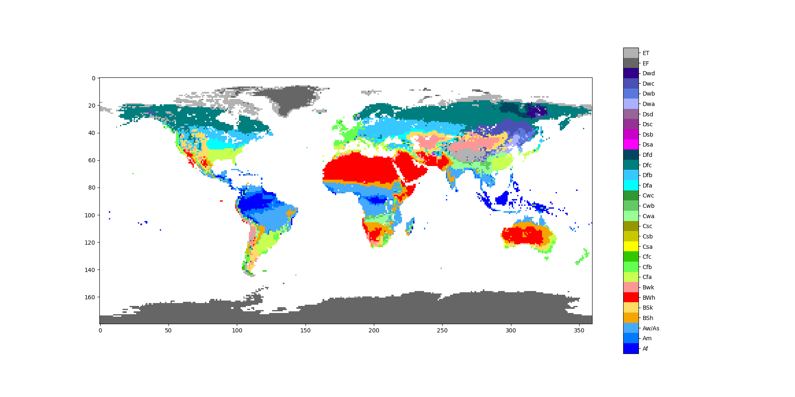
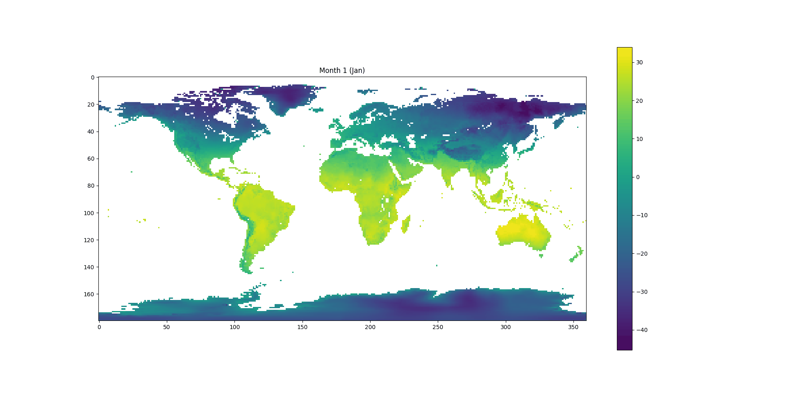
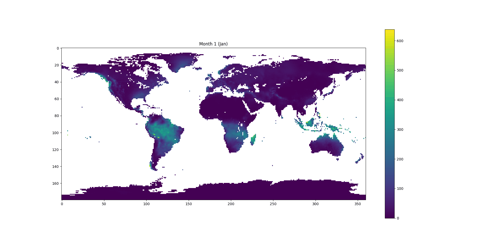
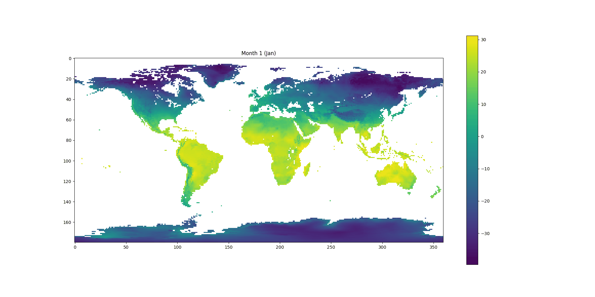
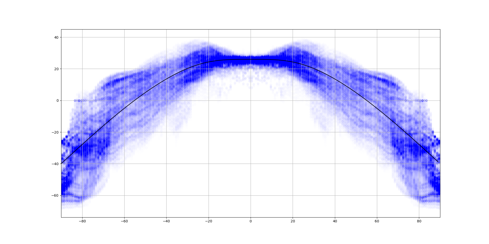
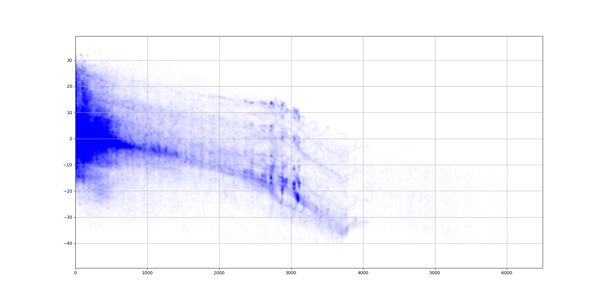
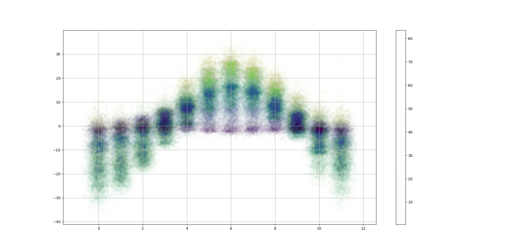
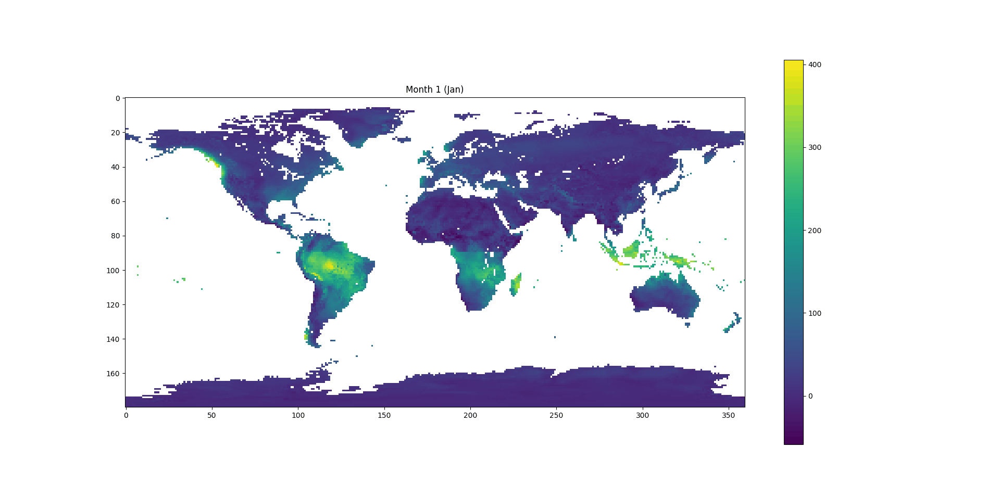

# Climate Learning (WORK-IN-PROGRESS)

A work-in-progress machine learning project to predict monthly temperature/precipitation from coastline data and elevation, which can be aggregated into a Koppen climate classification, as shown below: 

Here's what the real-world Koppen climate map looks like when processed in my program (with resolution to 1 degree), using nearest-neighbours sampling. It uses and same colours as the above picture and contains a legend.

There are many labels, but the most important details are the first letters - A for warm/wet equatorial regions, B for desert, C for temperate areas, D for continental/snowy areas, and E for polar regions. Here's my (so-far) best-performing model fitted to normal Earth, trying to predict normal Earth climates.

Libraries used are:
- **numpy**: For most data processing
- **pytorch**: For the neural network
- **matplotlib.pyplot**: For plots and visualizations
- **imageio**: For processing plots into gifs
- **os**: For removing generated gif frames

The model is very naïve as it does not take into account water depth, vegetation, thermohaline circulation, or the chemical makeup of the atmosphere/water.

The model has no practical scientific use, but it could be used as a fast, light-weight, high-resolution way (compared to real physics-based climate simulations) to predict data for hypothetical Earth-like land masses.

This project is not complete and **will not run properly** as I have not uploaded the necessary raw data to Github (it is 12 gigabytes). I will upload saved copies of data in the future, when my model is complete.

Also, I have some knowledge of climatology, but only to the level of a hobbyist.

## Issues

Predicting climate of an Earth-like planet doesn't neatly fit into most machine learning tasks because there is only one Earth (ie. one example). As such, how do you exactly measure overfitting? How do you know if something is a bad model or bad theoretical assumption?

Luckily, I know this scientific article (https://esd.copernicus.org/articles/9/1191/2018/) about the climate of a retrograde rotating Earth (ie. if Earth rotated backwards), which is a real physics-based simulation that I trust is likely to be accurate. So, I can sort of judge based on that by whether or not my model is bad.

Another issue is making sure the model treats the north and south hemispheres the same - as such, in my learning I have data for a map of Earth plus data for a map of Earth rotated 180 degrees. This allows the neural network to be consistent across latitudes.

Also, latitude, elevation, and coastlines alone is not enough data - we need points to be "aware" of the areas around them, similar to the principles of a convolutional neural network. Lots of time was spend essentially performing convolutions on these pieces of data to calculate inputs like how many pixels inland a piece of land is, or the "influence" of water on the land, elevation differences in certain directions, etc. A lot of these calculations are unfortunately impacted by the map projection being used (equirectangular) and limited choices of directions. I did not use a convolutional neural network because I already had a good idea of the types of data that should be theoretically useful, and I had less experience working with them.

## Temperature and Precipitation

For the sake of reference, here is a generated gif of real monthly temperatures across Earth:

and precipitation:

## Learning Temperature

I started on and have focused most of my efforts on predicting monthly temperature. The biggest time sink has been going back and forth between data processing and data analysis to find better correlations and reduce loss and converge quicker.

Always try simple models first, so here is the results of basic multivariate linear regression. There're clearly flaws in how high elevations in the northern hemisphere seems to get colder in the summer.

Here's another attempt, using extra latitude features. I hoped it wouldn't be prominent, but you can really see three unnatural horizontal bars (the latitude inputs). At least it solved the elevation issue.

Here's another attempt, where I treated latitude completely differently and modelled it as a single input to constantly move with time. This took a lot of time and looked more natural, but the elevation issue came back.

After massive tweaking to how the inputs are processed, here is a gradient descent attempt by a 1-layer neural network using a Relu activation function followed by 70 * tanh(x / 140), a learning rate of 0.001, and applying momentum:

And here's its prediction on a retrograde Earth:

I do worry that the network has overfitted, as I feel West Siberia (as in, East Siberia in the normal Earth) should be much warmer and that this retrograde model predicts it to be almost as cold as it was before.

I attempted using neural networks before linear regression, but my inputs were not well-processed for the task, so I ended up with super-long convergence times that overfitted a lot. But this attempt with better features worked out pretty well. There's still many rough edges though:
- Patagonia should get warmer in the summer and colder in the winter
- Northern Africa is too cold during the winter
- Northern coasts of Australia is warmer than the interior during January
- Northern Antarctica is too warm

After some tweaking to the data processing, and trying different techniques like dropout, batch descent (to speed things up), boosting, and different activation functions, my results did not change much:

There are similar error areas as last time, plus whatever is happening in Greenland. A factor I think is contributing to poor predictions is the small number of layers in my network (only 1, apart from the input and output layers), which I did to preserve speed, although I did try an extra layer and it did not improve. So, I'm going to try doing some modelling and and account for some more obvious trends before letting the neural network solve the smaller, subtler problems:

For instance, we can capture most of the latitude-induced variation from a slightly-flattened cos curve:

And higher elevation seems to linearly correlate with lower temperatures (except the caps of Antarctica at 3000-4000ish m of elevaton):

And northern hemispheres follow a nice cos curve depending on month:

So I'd subtract these best-fit curves from the data first, then let the neural net figure out everything else. The result is my current final result, and is slightly better:

## First Prediction

So, I haven't got around to working with precipitation yet, but I was impatient to see how well my model was, so I tried fitting the precipitation data using the temperature-specific neural net and inputs, and it got this:

Which is obviously not very good, but when you factor both of these in and compute the Koppen classifications, you have a result that isn't actually that horrible (even though it is rather noisy and messy)

Here's a prediction with retrograde Earth's climate:

Alternately visualized as

This is what an actual physics simulation predicts (top for retrograde):

I'm surprised that my model is not actually that bad!

EDIT:

Extended to render realistic satelite images in a Hackathon - https://devpost.com/software/ai-climate-drawer
