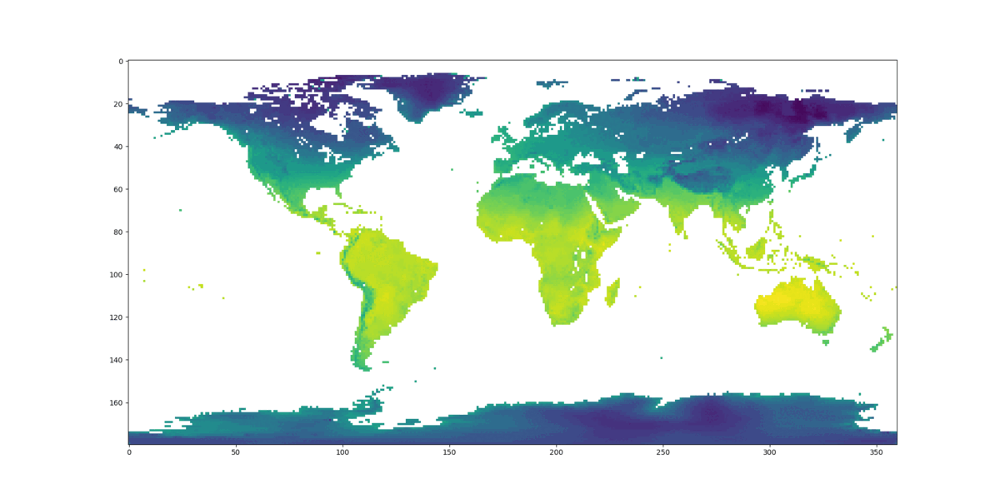
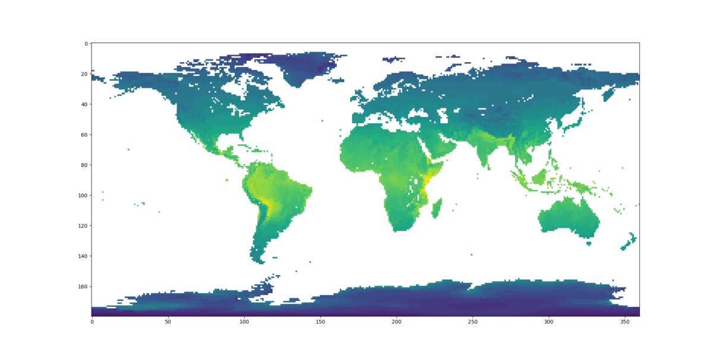
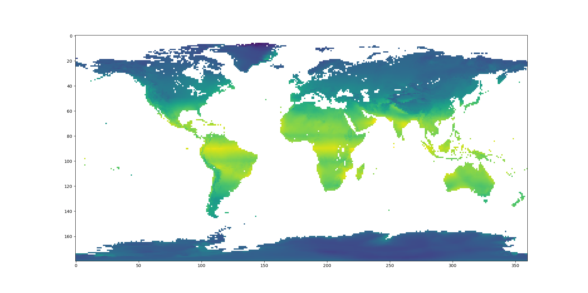
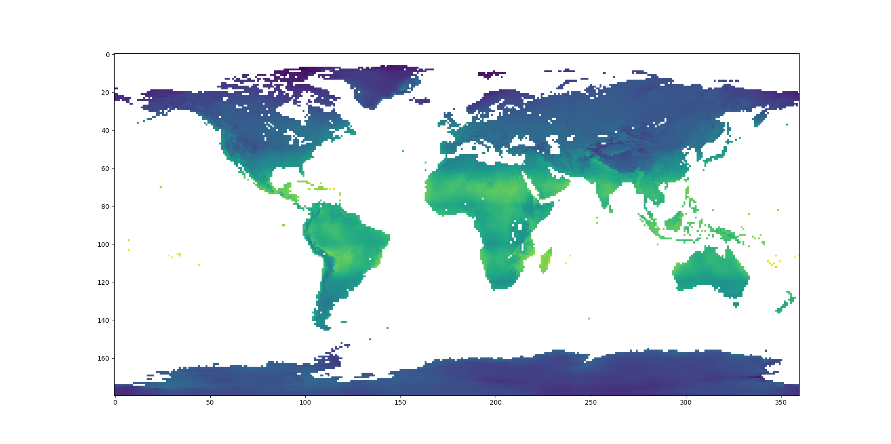
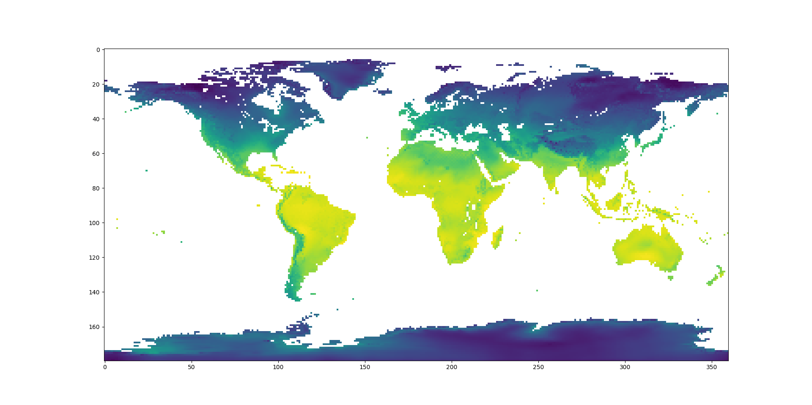

# Climate Learning

A work-in-progress machine learning project to predict monthly temperature/precipitation from coastline data and elevation, which can be aggregated into a Koppen climate classification (see https://commons.wikimedia.org/wiki/File:K%C3%B6ppen-Geiger_Climate_Classification_Map.png).

The model is naïve as it does not take into account water depth, vegetation, thermohaline circulation, or the chemical makeup of the atmosphere/water.

The model has no practical scientific use, but it could be used as a fast, light-weight, high-resolution way (compared to real physics-based climate simulations) to predict data for hypothetical Earth-like land masses.

I have not uploaded the raw data to Github because it is 12 gigabytes. I will uploaded saved copies of data in the future, when my model is coomplete.

## About

Predicting climate is a task that doesn't neatly fit into most machine learning tasks because there is only one Earth (ie. one example). If you break up individual pixels into input and target sets, there's a real risk of overfitting.

Luckily, I've been aware of this scientific article (https://esd.copernicus.org/articles/9/1191/2018/) about the climate of a retrograde rotating Earth (ie. if Earth rotated backwards), which is a real physics-based simulation that I trust is likely to be accurate. So, I can sort of judge based on that by whether or not my model overfits.

I have some knowledge of climatology, but only to the level of a hobbyist.

## So Far...

I am focused on predicting monthly temperature for now. I am mostly finished with the data collection, going back and forth between the data processing phase and data analysis phase to reduce loss and converge quicker in my models (a horrendously long and perserverance-needing process).

Here is a generated gif of real monthly temperatures across Earth:

Here is my first attempt, using basic multivariate linear regression. There're clearly flaws in how high elevations in the northern hemisphere seems to get colder in the summer.

Here's another attempt, using extra latitude features. I hoped it wouldn't be prominent, but you can really see three unnatural horizontal bars (the latitude inputs). At least it solved the elevation issue.

Here's another attempt, where I treated latitude completely differently and modelled it as a single input to constantly move with time. This took a lot of time and looked more natural, but the elevation issue came back.

Here is a gradient descent attempt by a 3-layer neural network using relu(x), followed by 70 * tanh(x / 140), learning rate of 0.001, and momentum:

And here's its prediction on a retrograde Earth:

I actually attempted neural networks first, but my inputs were not well-processed for the task, so I ended up with super-long convergence times that overfitted a lot. But this attempt with better features worked out pretty well. There's stil many rough edges though:
- Patagonia should get warmer in the summer and colder in the winter
- Northern Africa is too cold during the winter
- Northern coasts of Australia is warmer than the interior during January
- Northern Antarctica is too warm
